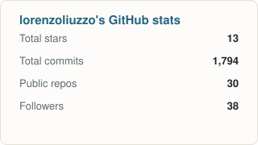
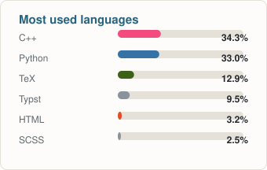

# Lorenzo Liuzzo

Physicist and software engineer specialized in AI. I came to software through
physics — derive the model first, then write the code.

## Building

**[MyThingsLab](https://github.com/MyThingsLab)** — a personal lab for AI-assisted
development: 50+ small Python tools on one dependency-free SDK, covering research,
design, implementation, testing and documentation. Headless workers do the
deterministic work themselves and call the model only where judgement is needed,
then open a pull request — never a merge, so the last word stays mine.

**[Money Balling AI](https://github.com/MoneyBallingAI)** — a team of four building
one model that predicts the exact box score of an NBA game — every player and team
line — with calibrated uncertainty. A graph encoder over lineup stints, a Monte
Carlo possession simulator, and calibration scored against the real box score.

## Featured projects

| Project | What it does |
|---|---|
| [EGNN](https://github.com/lorenzoliuzzo/EGNN) | Gauge-equivariant GNN simulations of lattice Standard Model field theory (SU(3)&times;SU(2)&times;U(1), Wilson-Dirac fermions, Higgs SSB) |
| [TFIM](https://github.com/lorenzoliuzzo/TFIM) | Quantum phase transitions in the Transverse Field Ising Model, on PennyLane |
| [Supervised Learning on Food Images](https://github.com/lorenzoliuzzo/supervised-learning-on-food-images) | A &lt;10M-parameter CNN classifying the 251 classes of FoodX-251 |
| [PhotoNim](https://github.com/lorenzoliuzzo/PhotoNim) | CPU raytracer with BVH optimization based on k-means clustering |
| [ctda-cpp](https://github.com/lorenzoliuzzo/ctda-cpp) | Compile-time dimensional analysis — C++ types with dimensional awareness |
| [Unsupervised Learning on Country Data](https://github.com/lorenzoliuzzo/unsupervised-learning-on-country-data) | Clustering countries on socio-economic indicators |

More at [lorenzoliuzzo.github.io/projects](https://lorenzoliuzzo.github.io/projects/).

## Stack

&nbsp;

&nbsp;

## GitHub

Self-hosted, updated daily by [a workflow](.github/workflows/update-stats.yml) in this
repo — no dependency on a third-party stats service.

